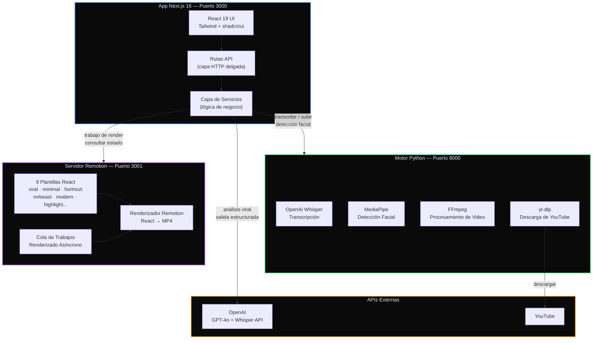
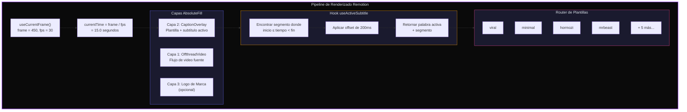
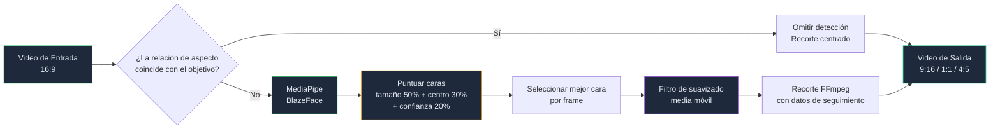

# Construí Mi Propia Herramienta de Recorte de Video con IA Porque las de Pago Eran Demasiado Caras

Como muchos de ustedes saben, siempre estoy intentando compartir conocimiento — ya sea a través de videos, charlas o entrevistas. Y de cada sesión, me gusta extraer los momentos más potentes y convertirlos en Shorts.

**¿El problema?**

La mayoría de herramientas que hacen esto son de pago. Y no poco — *bastante* caras.

Ahora, no es que sea tacaño. Pero pensé:

> "Un ingeniero construyó esta herramienta. Yo también soy ingeniero. Así que puedo construir la mía."

Y luego reflexioné:

> "Bueno... no solo yo. **Yo + Claude.**"

Y así nació **Video Wizard** — una herramienta open-source impulsada por IA para convertir videos largos en contenido corto con subtítulos, recorte inteligente y plantillas profesionales.

En este post, te guiaré por la arquitectura, las decisiones técnicas y lo que aprendí construyendo un pipeline de procesamiento de video de nivel producción como proyecto personal.

---

## ¿Qué Hace?

Este es el pipeline completo:

1. **Sube un video** (o pega una URL de YouTube)
2. **La IA transcribe** el audio usando OpenAI Whisper
3. **GPT-4o analiza** la transcripción y detecta los momentos más virales (puntuados de 0 a 100)
4. **Recorte inteligente** con detección facial (MediaPipe + OpenCV) reencuadra para formato vertical
5. **Edita subtítulos** en un editor visual — fusionar, dividir, limpiar muletillas
6. **Elige una plantilla** — 9 estilos de subtítulos profesionales construidos como componentes React
7. **Renderiza el video final** con Remotion
8. **Descarga** — listo para TikTok, Reels o YouTube Shorts

Pero no es solo un extractor de clips. También hay un **Generador de Subtítulos independiente** que omite el análisis de IA y va directo desde la subida hasta los subtítulos renderizados, y una herramienta de **Inteligencia de Contenido** para analizar transcripciones sin video.

---

## La Arquitectura: Tres Servicios, Un Objetivo

Elegí un enfoque de **monorepo con microservicios** usando Turborepo. Tres servicios independientes, cada uno haciendo lo que mejor sabe hacer:



Y aquí está el pipeline completo de procesamiento de video — desde la subida hasta la descarga:

```mermaid
flowchart LR
    A["Subir Video<br/>o URL de YouTube"] --> B["Motor Python"]
    B --> C{"Whisper<br/>Transcripción"}
    C --> D["Subtítulos<br/>(segundos)"]
    D --> E["GPT-4o<br/>Análisis Viral"]
    E --> F["Clips Virales<br/>puntuados 0-100"]
    D --> G["Editor de Subtítulos<br/>(milisegundos)"]
    G --> H["Seleccionar Plantilla<br/>+ Relación de Aspecto"]
    H --> I["Servidor Remotion"]
    I --> J["Componentes React<br/>→ Frames de Video"]
    J --> K["Codificación FFmpeg<br/>→ MP4"]
    K --> L["Descargar"]

    style A fill:#1e293b,stroke:#3b82f6,color:#e2e8f0
    style B fill:#1e293b,stroke:#22c55e,color:#e2e8f0
    style C fill:#1e293b,stroke:#22c55e,color:#e2e8f0
    style D fill:#1e293b,stroke:#f59e0b,color:#e2e8f0
    style E fill:#1e293b,stroke:#f59e0b,color:#e2e8f0
    style F fill:#1e293b,stroke:#f59e0b,color:#e2e8f0
    style G fill:#1e293b,stroke:#3b82f6,color:#e2e8f0
    style H fill:#1e293b,stroke:#3b82f6,color:#e2e8f0
    style I fill:#1e293b,stroke:#a855f7,color:#e2e8f0
    style J fill:#1e293b,stroke:#a855f7,color:#e2e8f0
    style K fill:#1e293b,stroke:#a855f7,color:#e2e8f0
    style L fill:#1e293b,stroke:#10b981,color:#e2e8f0
```



**¿Por qué tres servicios?**

- **Python** tiene las mejores librerías de video/ML (FFmpeg, MediaPipe, Whisper). No hay una buena alternativa en el ecosistema JS para detección facial + recorte inteligente.
- **Remotion** necesita su propio servidor porque empaqueta componentes React en frames de video — consume muchos recursos y se beneficia del renderizado aislado.
- **Next.js** maneja la UI, el enrutamiento de APIs y la orquestación. Es el pegamento.

---

## La Idea Clave: Video como Componentes React

Este fue el momento "eureka" para mí.

Elegí [Remotion](https://www.remotion.dev/) porque te permite tratar el video como una interfaz. Componentes, props, composición — pero aplicados a contenido audiovisual.

Así es como luce una plantilla de subtítulos. Es simplemente un componente React:

```tsx
export function HormoziTemplate({ currentSegment, isActive, brandKit }: CaptionTemplateProps) {
  const frame = useCurrentFrame();
  const { fps } = useVideoConfig();

  if (!isActive || !currentSegment) return null;

  const words = currentSegment.text.split(' ');

  return (
    <AbsoluteFill style={{ justifyContent: 'flex-end', alignItems: 'center' }}>
      <div style={{ display: 'flex', gap: 12 }}>
        {words.map((word, i) => {
          const wordDelay = i * 4;
          const scale = interpolate(frame, [wordDelay, wordDelay + 8], [0.5, 1.15]);
          const translateY = interpolate(frame, [wordDelay, wordDelay + 8], [40, 0]);

          return (
            <span key={i} style={{
              transform: `translateY(${translateY}px) scale(${scale})`,
              color: brandKit?.textColor ?? '#FFFFFF',
              fontFamily: brandKit?.fontFamily ?? 'Montserrat',
            }}>
              {word}
            </span>
          );
        })}
      </div>
    </AbsoluteFill>
  );
}
```

**Cada frame es una función del tiempo.** `useCurrentFrame()` te da el número de frame actual, e `interpolate()` lo mapea a cualquier propiedad CSS. Sin APIs imperativas de video, sin líneas de tiempo — solo React declarativo.

Construí 9 plantillas de esta manera: desde `minimal` limpio hasta el estilo `mrbeast` de alta energía, cada una con diferentes animaciones, tipografía y esquemas de color. Cambiar de plantilla es solo cambiar un prop.

Así es como funcionan las capas de composición de Remotion:



---

## Seguimiento Facial Inteligente: El Lado de Python

El desafío algorítmico más interesante fue el recorte inteligente. Cuando conviertes un video 16:9 a 9:16, necesitas decidir *dónde* recortar — e idealmente, seguir la cara del hablante.

El motor de procesamiento usa el modelo BlazeFace de MediaPipe para la detección, luego aplica un **algoritmo de puntuación ponderada** cuando aparecen múltiples caras:

```python
score = (size_score * 0.5) + (center_distance * 0.3) + (confidence * 0.2)
```

- **50% de peso en el tamaño de la cara** — el hablante suele estar más cerca de la cámara
- **30% en proximidad al centro** — los sujetos principales tienden a estar centrados
- **20% en confianza de detección** — confiar en el modelo

Después de seleccionar la cara por frame, un **filtro de suavizado de media móvil** elimina el jitter:

```python
smoothed_positions = np.convolve(
    raw_positions,
    np.ones(window_size) / window_size,
    mode='same'
)
```



¿El resultado? Movimiento de cámara con calidad cinematográfica que sigue al hablante sin la sensación de "cámara de seguridad". Y es lo suficientemente inteligente como para omitir la detección facial por completo cuando el video fuente ya coincide con la relación de aspecto objetivo.

---

## Sincronización de Subtítulos: La Parte Difícil de la que Nadie Habla

Lograr que los subtítulos se sincronicen correctamente entre tres servicios con diferentes formatos de tiempo fue la parte más complicada:

| Etapa | Formato | Ejemplo |
|-------|---------|---------|
| Salida de Whisper | Segundos | `{ start: 0.5, end: 2.3 }` |
| Editor del frontend | Milisegundos | `{ start: 500, end: 2300 }` |
| Renderizador Remotion | Segundos | `{ start: 0.5, end: 2.3 }` |

Un bug temprano hacía que videos de 60 segundos se renderizaran como 0.06 segundos porque los tiempos se dividían entre 1000 dos veces. Momentos divertidos.

También agregué un **offset de subtítulos configurable de 200ms** para compensar el retraso perceptual entre escuchar una palabra y leerla:

```typescript
const SUBTITLE_OFFSET = 0.2; // segundos
const adjustedTime = currentTime - SUBTITLE_OFFSET;
```

Un detalle pequeño, pero hace que los subtítulos se *sientan* perfectamente sincronizados.

---

## El Kit de Limpieza de Subtítulos

Más allá de la edición básica, construí detección automatizada para problemas comunes de subtítulos:

- **Detección de silencios** — pausas > 1 segundo entre segmentos
- **Detección de muletillas** — "um", "uh", "like", "you know" (13 por defecto)
- **Detección de segmentos cortos** — segmentos menores a 300ms (generalmente ruido)

Estas son **funciones puras** — sin efectos secundarios, fácilmente testeables:

```typescript
const result = detectIssues(subtitles, config);
const cleaned = removeDetectedIssues(subtitles, result.issues);
```

Un clic y tus subtítulos pasan de la salida cruda de Whisper a subtítulos limpios y profesionales.

---

## Decisiones de Arquitectura de las que Estoy Orgulloso

### Arquitectura Expresiva (Screaming Architecture)

La estructura de carpetas te dice qué hace la app antes de leer una sola línea de código:

```
features/
└── video/
    ├── components/     # "¡Yo renderizo la UI de video!"
    ├── hooks/          # "¡Yo gestiono el estado del video!"
    ├── containers/     # "¡Yo orquesto los flujos de trabajo del video!"
    ├── types/          # "¡Yo defino las formas de datos del video!"
    └── lib/            # "¡Yo proveo utilidades de video!"
```

### Separación Estricta de Responsabilidades

Las rutas API son **delgadas** — solo manejan HTTP y delegan a los servicios:

```typescript
// Ruta API: ~5 líneas de lógica
export async function POST(request: NextRequest) {
  const body = await request.json();
  const data = await subtitleGenerationService.generateSubtitles(body);
  return NextResponse.json({ success: true, data });
}
```

Toda la lógica de negocio vive en **clases de servicio** — reutilizables, testeables, sin preocupaciones HTTP:

```typescript
// Servicio: todo el trabajo real
export class SubtitleGenerationService {
  async generateSubtitles(input) {
    // 1. Llamar a la transcripción Python
    // 2. Convertir formatos de tiempo
    // 3. Estructurar la respuesta
  }

  async renderWithSubtitles(input) {
    // 1. Enviar trabajo a Remotion
    // 2. Consultar hasta completar
    // 3. Retornar URL del video
  }
}
```

### Zod en Todas Partes

Cada frontera externa se valida con Zod. Los tipos se infieren, no se duplican:

```typescript
const BrandKitSchema = z.object({
  logoUrl: z.string().optional(),
  logoPosition: z.enum(['top-left', 'top-right', 'bottom-left', 'bottom-right']),
  logoScale: z.number().min(0.1).max(2),
  primaryColor: z.string().regex(/^#[0-9A-Fa-f]{6}$/).optional(),
});

type BrandKit = z.infer<typeof BrandKitSchema>; // Tipos desde esquemas, no al revés
```

---

## El Stack Tecnológico

| Capa | Tecnología | Por qué |
|------|-----------|---------|
| Frontend | Next.js 16 + React 19 | App Router, server components, rutas API |
| Estilos | Tailwind + shadcn/ui | Rápido, accesible, consistente |
| Análisis IA | Vercel AI SDK + GPT-4o | Salida estructurada para detección de clips virales |
| Transcripción | OpenAI Whisper | Mejor precisión multilingüe |
| Detección Facial | MediaPipe (BlazeFace) | Ligero, tiempo real, no requiere GPU |
| Procesamiento de Video | FFmpeg + OpenCV | Estándar de la industria, probado en batalla |
| Renderizado de Video | Remotion | Basado en React, programático, amigable con plantillas |
| Validación | Zod | Seguridad en runtime + TypeScript |
| Monorepo | Turborepo + pnpm | Builds rápidos, paquetes compartidos |

---

## Lo que Aprendí

### 1. Ingeniero + IA = Producción Multiplicada

Este proyecto me habría tomado meses trabajando solo. Con Claude como programador en par, pasé de la idea al prototipo funcional significativamente más rápido. No porque la IA escribió todo — sino porque aceleró las partes tediosas (boilerplate, flags de FFmpeg, configuración de Remotion) para que yo pudiera enfocarme en la arquitectura y decisiones de producto.

### 2. Construye Tus Propias Herramientas

Cada vez dependemos más de SaaS externos para todo. A veces la mejor manera de aprender es construir la herramienta tú mismo. Entenderás procesamiento de video, pipelines de ML y motores de renderizado a una profundidad que ningún tutorial puede darte.

### 3. Los Microservicios No Son Solo para Equipos Grandes

Incluso para un proyecto en solitario, separar Python (video/ML), Remotion (renderizado) y Next.js (UI/orquestación) mantuvo cada pieza simple y enfocada. Cuando necesité cambiar el algoritmo de detección facial, no toqué una sola línea de código frontend.

### 4. Los Formatos de Tiempo Te Perseguirán

Si estás construyendo algo con subtítulos: elige un formato de tiempo (segundos o milisegundos) y mantente con él. Documenta tus conversiones. Prueba los límites. Tu yo del futuro te lo agradecerá.

---

## Qué Sigue

Este sigue siendo un proyecto personal, pero con funcionalidades que ya son bastante potentes:

- 9 plantillas de subtítulos profesionales
- Soporte multi-relación de aspecto (9:16, 1:1, 4:5, 16:9)
- Personalización de brand kit (logo, colores, fuentes)
- Limpieza automática de silencios y muletillas
- Exportación de subtítulos SRT/VTT
- Soporte de URLs de YouTube
- Transcripción multilingüe

**Algunas ideas en el roadmap:**
- Procesamiento por lotes para múltiples clips
- Constructor de plantillas personalizado (editor visual)
- Despliegue en la nube con escalado de cola de renderizado
- Diarización de hablantes (quién dijo qué)

---

## Pruébalo Tú Mismo

El repositorio es open source. Puedes ejecutar todo el stack localmente con:

```bash
pnpm install
pnpm dev
```

Luego abre `http://localhost:3000` y sube un video.

**Me encantaría tu feedback:**
- ¿Qué funcionalidad te gustaría ver?
- ¿Usarías esto para tu propio contenido?
- ¿Qué mejorarías?

PRs, issues y estrellas son bienvenidos.

**GitHub**: [github.com/el-frontend/video-wizard](https://github.com/el-frontend/video-wizard)

---

*Construido con Next.js, Python, Remotion y mucha ayuda de Claude.*